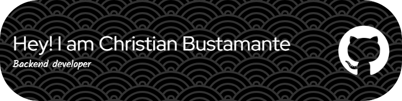

#  Hola,  bienvenid@ al GitHub de Christian Bustamante

 

Soy una persona altamente motivada, compremetida con la mejora continua y el crecimiento personal. Cuento con iuna capacidad destacada para generar y ejectuar ideas innovadoras que aporten beneficios a la empresa

### Tecnologias💻

         

